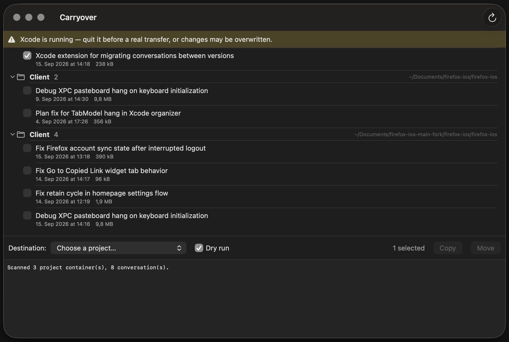

# Carryover

A small macOS utility that copies or moves **Xcode Coding Assistant conversations** between projects — including their Claude agent sessions — so your conversation history follows your code.

## The problem

Xcode ties every Coding Assistant conversation to a *workspace container* whose directory name is derived from a hash of the project's path:

```
~/Library/Developer/Xcode/UserData/CodingAssistant/
    MyApp-eqzwjakjzwvucubwlrgllpdjlmid/
```

Rename the project folder, move it, clone the repo to another location, or split a workspace — and Xcode computes a *new* hash. Your old conversations aren't deleted, but they're orphaned in the old container with no UI to bring them along. On top of that, agent-backed conversations keep their actual transcript in a *second* store with its own path-derived naming scheme:

```
~/Library/Developer/Xcode/CodingAssistant/ClaudeAgentConfig/projects/
    -Users-you-Documents-MyApp/<sessionID>.jsonl
```

Recovering a conversation by hand means editing a plist manifest, moving directories in both trees, and rewriting the `cwd` fields inside the session transcript so resume works. Carryover automates all of it.

## What it does

- **Scans** all Coding Assistant containers and lists their conversations, with dates, sizes, and the resolved project folder so same-named projects are distinguishable.
- **Copies or moves** selected conversations to a destination project:
  - the conversation directory and its manifest entry (unknown/new manifest keys are preserved verbatim, so transfers survive Xcode format additions),
  - referenced snapshot plists,
  - the Claude agent session (`.jsonl` transcript plus subagent sidecar directory), with every `cwd` rewritten to the destination project's folder so **Resume works from the new project**.
- **Dry run by default** — every action is logged before anything is written.
- **Backs up before writing**: manifests are backed up before any real transfer, and a Move additionally backs up every conversation directory, snapshot, and agent session file it will delete. Backups are timestamped under `~/Library/Application Support/Carryover/Backups/` and never deleted automatically.
- **Ordering is failure-safe**: file copies happen first, manifest edits last — a mid-transfer failure leaves at worst orphan directories (which Xcode ignores), never a corrupt manifest.

## Install

Download the latest `Carryover-x.y.z.zip` from [Releases](../../releases), unzip, and drag `Carryover.app` into `/Applications`.

Releases are ad-hoc signed but not notarized, so macOS quarantines the app the first time. One-time fix, either way works:

- Launch it once (macOS blocks it), then open **System Settings → Privacy & Security**, scroll down, and click **Open Anyway**.
- Or clear the quarantine flag in Terminal:

  ```sh
  xattr -d com.apple.quarantine /Applications/Carryover.app
  ```

Or skip all of that and build from source — you have Xcode anyway (see [Building](#building)).

## Usage

1. **Quit Xcode.** Xcode keeps the conversation manifests in memory and may overwrite changes when it quits. Carryover warns you if Xcode is running.
2. Launch Carryover. It scans your containers automatically.
3. Check the conversations you want to transfer, pick a destination project, and run with **Dry run** enabled to preview every step in the log.
4. Uncheck Dry run and hit **Copy** or **Move**. Move asks for confirmation and takes a full backup first.

If the destination project has no agent-backed conversations yet, Carryover can't infer the project's folder from existing sessions and will ask you to pick the folder the project is opened from.

## Requirements

- macOS 14 or later
- Xcode with the Coding Assistant (Claude in Xcode)

## Building

Open `Carryover.xcodeproj` in Xcode and run. No dependencies.

## ⚠️ Caveats

Carryover is built entirely on **undocumented Xcode internals**: the `CodingAssistantManifest.plist` format, the container-name hashing convention, and the `ClaudeAgentConfig/projects` layout. Apple can change any of these in any Xcode release, at which point Carryover may fail to scan or transfer until updated. It is defensive about this — manifest entries are copied verbatim, dry run is the default, and real transfers are backed up first — but treat it as a power tool: preview with dry run, and keep Xcode closed during transfers.

## License

MIT — see [LICENSE](LICENSE).
